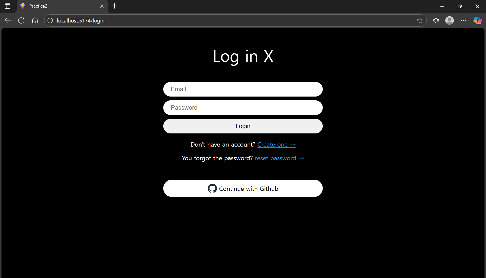
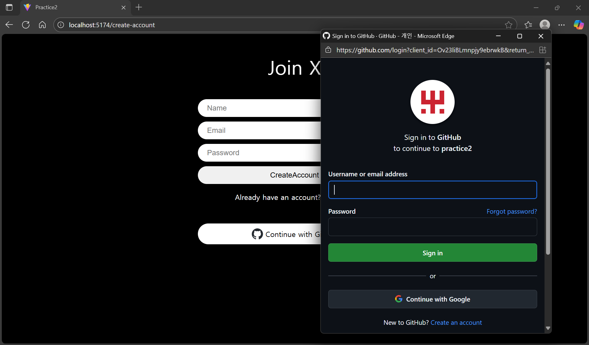
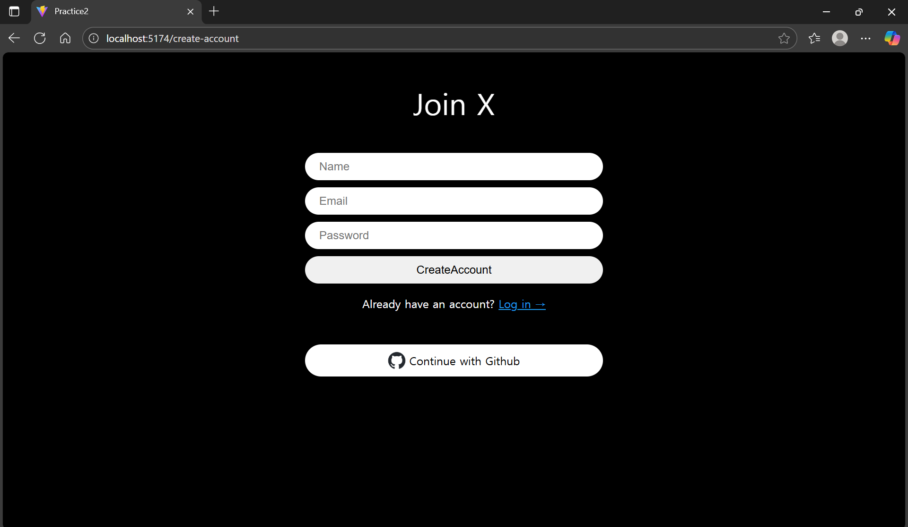

2학년 방학동안 수강해본 react 연습 프로젝트 입니다.
Firebase를 이용해서 각 user들을 관리했습니다.

## 기술 스택
- React 및 React Router
- TypeScript
- CSS / Styled - components

## 실행 방법
- npm run dev

## 기능
- 로그인/회원가입 화면
- Github 연동 가능 페이지

## 실행 화면
- 
- 
- 

